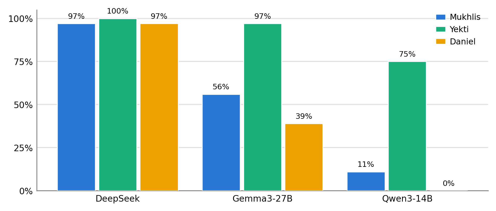

# Diagnosing a Register-Pragmatic Blind Spot in Javanese Hate Speech Detection

**Mukhlis Amien¹, Yekti Asmoro Kanthi², Daniel Rudiaman Sijabat³**
¹,²,³ Department of Informatics, Universitas Bhinneka Nusantara, Malang, Indonesia
email: ¹amien@ubhinus.ac.id, ²yektiasmoro@ubhinus.ac.id, ³daniel223@ubhinus.ac.id

---

## ABSTRACT

Hate speech in Javanese — spoken by roughly 84 million people — poses a distinct detection challenge because its honorific register system (*unggah-ungguh*) lets identical hostile content surface as vulgar *ngoko* or as deceptively refined *krama*. *Krama* hostility is diglossically confined to formal, face-to-face contexts and thus structurally absent from social-media corpora, leaving corpus-based detection blind to an entire class of Javanese hate by construction. We diagnose this blind spot, constructing a register-stratified stimulus set via large language models across four register-pragmatic niches and nine target groups (ethnic, religious, gender, political — a 36-cell matrix), validated for authenticity by three raters. The strongest generator, DeepSeek, is judged 97–100% authentic by all three raters; pooled authenticity is rater-dependent (45–91%). The free local model Qwen3-14B fails entirely at *krama*, producing Indonesian instead of Javanese. Running the stimuli through five detector models reveals a near-universal blind spot: only 2 of 45 verdicts (4%) flag ironic *krama* stimuli as hate, versus 100% for *ngoko*-direct hate — and human raters converge on the same uncertainty, evidence that *pasemon*'s deniability defeats human and machine judgment alike. Politeness alone does not blind detectors — *krama-report* without irony is caught at 78–89%; the failure is pragmatic implicature. Two independent scarcity measurements corroborate the diagnosis: a labeling run on 735 texts finds zero consensus *krama*-hate, and a lexicon scan of 1.42 million general-topic tweets finds Javanese at only 0.093% presence, the highest of ten regional languages surveyed. The stimulus set and blind-spot proof form a reproducible instrument for diglossic, register-rich languages.

**Keywords:** detection blind spot, hate speech detection, Javanese, large language model, register

---

## 1. INTRODUCTION

Javanese is spoken by roughly 84 million people and carries significant online hate speech directed at ethnic minorities (Madurese, Chinese-Indonesian, Arab communities), religious groups, women, and LGBTQ+ individuals [1], [2], [3]. Yet the language is severely under-resourced in NLP relative to general-Indonesian resources [4], [5], [6], [7], [8], and the few published hate-speech datasets for Javanese either remain unreleased [9] or conflate Javanese with broader Indonesian [10], [11]. Prior work has explored GPT-based data augmentation for low-resource, code-mixed Indonesian hate speech detection more broadly [12], [13], [14], including fine-tuning detectors on large samples of generated hate speech [15], most recently extending to multimodal Indonesian hate speech [16] and to explainability audits of detector behavior in Indonesian informatics journals [17], but without Javanese register-pragmatic structure as the organizing axis — the central contribution of this paper. In English, the difficulty of *implicit* hate for automated detectors is well documented [18], and machine generation has been used to construct implicit-hate corpora at scale [19]; neither line of work, however, addresses register or diglossia, and no equivalent exists for Javanese.

A feature of Javanese that existing approaches entirely overlook is its *unggah-ungguh* (speech-level) system: the same hostile proposition can be expressed in coarse *ngoko* — the register of in-group bluntness — or in the refined *krama* register, producing qualitatively different pragmatic effects. Hot, direct rage is *ngoko*; cold contempt, ironic superiority, and indirect defamation — the forms that most damage group dignity — are *krama*. This is not a stylistic choice but a rule-governed pragmatic constraint, validated by a native speaker in this work.

The practical consequence is a data collection paradox. Social-media Javanese hate speech is almost entirely *ngoko* with code-mixing [20], [21]; pure *krama* is essentially absent from public posts because *krama* is used in formal or face-to-face contexts, not in Twitter or WhatsApp broadcasts [22]. A standard corpus-filtering pipeline will collect *ngoko* hate, confirm the register, and leave *krama* hate completely uncollected. We verified this directly: filtering 12,700 tweets from a public Indonesian hate-speech dump [23] yields 735 candidate Javanese texts, of which **zero** carry consensus *krama*-hate in the majority-vote labeling.

This scarcity is not an artifact of one corpus or one filtering method. An unrelated companion measurement of Javanese digital presence — a lexicon-based scan of a general-topic (non-hate-filtered) Indonesian Twitter corpus spanning 32 cities and roughly 1.42 million cleaned, deduplicated tweets — confirms the same pattern from an independent angle [24]. Counting a tweet as confirmed-Javanese only if it contains two or more lexically distinctive Javanese function words or particles, just 1,321 tweets (0.093%) qualify. Table 1 places this in comparative context: among ten Indonesian regional languages surveyed in the same corpus, Javanese has both the largest speaker population (84.3 million, exceeding the other nine combined) and the *highest* confirmed-tweet rate — yet even this best case clears well under one tweet in a thousand. Two measurements that share no data, no method, and no base population — an LLM-based semantic filter over an already hate-labeled corpus (74 of 7,823 deduplicated tweets ≈ 0.9% [23]) and a lexicon-keyword filter over a general-topic corpus (1,321/1,419,641 ≈ 0.093% [24]) — converge on the same conclusion: Javanese is structurally underrepresented in exactly the public channels that hate-speech corpora are built from, regardless of how the filtering is done. This is not a contradiction of Javanese's 80-million-speaker population but consistent with it: sociolinguistic work on Javanese specifically argues that speaker-population size alone does not guarantee domain vitality, and documents a real, urbanization- and class-linked shift away from Javanese (particularly its *krama* register) toward Indonesian in exactly the informal, everyday domains that social media represents [25], [26].

**Table 1.** Confirmed-tweet rate for ten Indonesian regional languages in a general-topic, 32-city Twitter corpus (≈1.42M cleaned tweets; lexicon match, ≥2 distinctive-word threshold per tweet) [24]. Not to be confused with the hate-detector verdict rates in Table 5.

| Language | Speakers (M) | Confirmed tweets | Confirmed rate |
|---|---|---|---|
| Javanese | 84.3 | 1,321 | 0.093% |
| Acehnese | 3.5 | 515 | 0.036% |
| Banjarese | 3.5 | 302 | 0.021% |
| Minangkabau | 5.5 | 286 | 0.020% |
| Sundanese | 34.0 | 256 | 0.018% |
| Balinese | 3.3 | 81 | 0.006% |
| Ngaju | 0.9 | 71 | 0.005% |
| Toba Batak | 2.0 | 38 | 0.003% |
| Madurese | 7.0 | 11 | 0.0008% |
| Buginese | 5.0 | 2 | 0.0001% |

This paper addresses the collection paradox with a diagnostic approach analogous to functional test suites for hate speech detection [27]: rather than filtering and labeling an existing corpus, we construct a register-stratified set of Javanese hate-speech stimuli [28] — using large language models (LLMs) as the construction *method*, not as the object of study — validate each stimulus with a native expert, and probe the set with five hate-speech detector models. The contribution is not a large dataset but a controlled diagnostic instrument: a minimal sufficient set that proves a specific failure mode exists, is reproducible, and is systematically missed by current automated detection. Generation is the *means* by which the otherwise-uncollectable *krama* niches become testable; the finding that matters is what the resulting stimuli reveal about detection, not the stimuli themselves. A contemporaneous HateCheck-style functional test suite for Southeast Asian languages covers Indonesian, Tagalog, Thai, and Vietnamese but not Javanese [29], and the multilingual extension of HateCheck spans ten languages, none of them Indonesian regional languages [30] — the register-diglossia failure mode diagnosed here remains unaddressed even in the most directly comparable recent work.

**Why the human bottleneck matters here.** This work is directly motivated by a prior failure: student annotators in a precursor project produced nominally "Javanese" data primarily by back-translating Indonesian and English hate speech, yielding labels that were internally consistent but not grounded in authentic Javanese expression. The corruption was invisible until downstream models failed to generalize. The generator approach avoids this bottleneck by design: the human role collapses to *authenticity refereeing* (native speaker judges whether generated text sounds like real Javanese hate), which requires native comprehension rather than full annotation labor.

**Contributions.** (1) Empirical proof of a *detection blind spot*: Javanese ironic hate (*pasemon* in *krama*) evades all five tested detectors — cloud and local — at a rate of 96%, while explicit *ngoko* hate is caught at 100%; the failure traces to pragmatic implicature, not surface politeness. (2) A *register-pragmatic model* of Javanese hate speech — a taxonomy of four niches defined by the interaction of register and pragmatic mode, validated with a native expert — that explains *why* the blind spot exists, not merely that it does. (3) A register-stratified diagnostic stimulus set, constructed via LLM generation and validated for native authenticity, that makes the otherwise-uncollectable *krama* niches testable for the first time; generation here is a construction method in service of diagnosis, not an end in itself, and the resulting set is released under a restricted, research-only license precisely because it demonstrates how current detectors can be evaded. (4) A publicly released codebook, diagnostic construction scripts, and evaluation pipeline for reproducible extension to other diglossic, register-rich languages.

---

## 2. METHOD

### 2.1. Hate speech definition

We define hate speech operationally as text that **attacks, demeans, dehumanizes, or incites violence or discrimination against a person or group based on group identity** — ethnicity (*suku*), religion or belief (*agama/kepercayaan*), gender or sexual orientation, social class, or political collective. The decisive criterion is *direction of attack toward group identity*, not coarseness of language. Javanese is rich in profanity (*pisuhan*: *asu*, *jancuk*, *cok*) that functions as in-group bonding in the Arek/Surabaya register; coarseness alone is not hate. This distinction is the single most error-prone boundary in Javanese moderation.

### 2.2. Four-dimensional taxonomy

The taxonomy has four dimensions (full definitions, decision trees, and worked examples in the released codebook):

**Target group** — ethnicity (*suku Madura, Tionghoa, Sunda, Batak, Arab*, …), intra-Javanese region (*Mataraman, Arek, Banyumasan*), religion or belief, gender/LGBTQ+, political collective, or *tidak ada*.

**Severity** — *BUK* (not hate) / *ringan* (light: stereotyping) / *sedang* (moderate: dehumanization, exclusion) / *berat* (severe: threats, incitement).

**Register** — *ngoko / madya / krama / campur kasar*. This dimension is the paper's primary focus; see Section 2.3.

**Form** — *direct / sarcastic / idiomatic (pasemon) / code-switched*.

### 2.3. The register-pragmatic model: four niches

Hostility in Javanese is not register-flat. The interaction between speech level and pragmatic intent produces four empirically distinct niches (Table 2, Figure 1), validated by a native Javanese speaker:

**Table 2.** The four register-pragmatic niches: register, pragmatic mode, and mechanism.

| Niche | Register | Pragmatic mode | Mechanism |
|---|---|---|---|
| N1 *ngoko direct* | ngoko/kasar | Hot, open aggression | Explicit slur + profanity to addressee or about group |
| N2 *krama report* | krama alus | Derogatory report, absent target | Polite prayer/concern framing derogate-third-party ("*Mugi tiyang X enggal…*") |
| N3a *krama sarcastic* | krama alus | Ironic over-praise (pasemon) | Mock-deference: weaponized honorifics ("*Panjenengan wicaksana sanget…*") |
| N3b *krama cold contempt* | krama alus | Moral/hierarchical superiority | Cold indictment: target accused of lacking *isin* or *unggah-ungguh* |

**Figure 1.** The four register-pragmatic niches (mechanism detail as in Table 2), grouped by register: *ngoko* (hot, direct) vs. *krama* (cool, indirect), the latter spanning three distinct pragmatic modes.

A key empirical finding (Section 3.4) is that N2–N3b are essentially absent from social-media data — confirmed by zero consensus *krama*-hate in 728 labeled real texts — establishing the collection paradox and motivating generation.

### 2.4. Why *krama* hate is uncollectable

Two structural factors make *krama* hate unrepresented in social-media corpora. First, *diglossia*: *krama* is the register of formal, elder-addressee, or face-to-face speech; social-media Javanese defaults to *ngoko* with Indonesian code-mixing [22]. Second, *irony recognition* [31], [32]: even if a *krama-sarcastic* post were found, an automated classifier would need to resolve pragmatic implicature (*pasemon*) — a specifically Javanese indirect speech act — rather than surface lexical hostility. Section 3.3 shows this is beyond all five tested detectors.

### 2.5. Evidence of scarcity: the labeling baseline

Before generation, we establish the scarcity empirically. We filter a public Indonesian hate-speech dump [23] for Javanese and code-mixed text using an LLM filter (validated in a 250-tweet pilot: 100% JSON validity, 9.6% Javanese yield), apply a two-stage cascade (free local pre-screen → cloud verification), and label the resulting pool with three LLM raters (DeepSeek, Grok, Qwen3-14B/local) using a culturally-grounded prompt [33], [34]. Inter-rater reliability throughout this paper is measured with Krippendorff's alpha [35], defined in (1):

{{EQUATION_1}}

where D_o is the observed disagreement among raters and D_e is the disagreement expected by chance; alpha = 1 indicates perfect agreement and alpha = 0 chance-level agreement. The cascade's cloud confirmation rate of **23.9%** (403 of 1,687 pre-screen survivors) is itself a finding: cheap local models reduce a candidate pool but cannot replace cloud precision for filtering.

The resulting pool yields **728 consensus-labeled instances** (158 hate, 21.7%; α Krippendorff [35] 0.51 three-rater held-out, 0.69 for the cloud pair), of which **register is *ngoko* for 157/158 hate instances** and *krama*-hate consensus is zero. This negative result serves two purposes: it motivates generation by proving the collection paradox, and the 728 texts serve as a realism anchor for generator calibration.

Full methodology of the labeling pipeline — prompt engineering (Δα ≈ +0.23 from two definition corrections), vendor selection, cascade economics, and adversarial verification — is documented in the supplementary report. The core finding relevant to this paper: **social-media filtering cannot produce *krama* hate at meaningful scale, even from a 12,700-tweet dump.**

### 2.6. Constructing the diagnostic stimulus set

We construct a **4-niche × 9-target = 36-cell matrix** of Javanese hate-speech stimuli using DeepSeek [36] as the primary construction model and Gemma3-27B [37] and Qwen3-14B [38] (both running locally) for comparison, producing **108 total examples** (3 per cell). The nine target groups span the Indonesian SARA taxonomy (*suku, agama, ras, antargolongan* — ethnicity, religion, race, and inter-group relations): *suku* (Madura, Tionghoa, Arab), *agama* (Islam, Kristen), *gender* (wanita, LGBTQ+), *politik* (collective), and intra-Javanese (*Arek vs. Mataraman*).

Each generation call specifies: (a) niche (N1–N3b), (b) target group, (c) a culturally-grounded system prompt (in Indonesian) that defines the niche's pragmatic mechanism and provides two-to-four few-shot examples. The system prompt explicitly prohibits "museum krama" (literary-Javanese vocabulary unused in living speech) and Indonesian code-leak. Generation uses the same API infrastructure as the labeling pipeline; DeepSeek calls use `max_tokens=8192` to allow adequate reasoning budget. The specific API endpoint used (`deepseek-v4-pro`) postdates the cited DeepSeek-V3 technical report [36]; no separate V4 technical report could be independently verified at the time of writing, so [36] is cited as the closest documented architecture family rather than an exact version match.

### 2.7. Native authenticity validation

The 108 generated examples are submitted to the first author (native Javanese speaker from East Java) for authenticity validation. The validation instrument is a structured spreadsheet with: (a) the generated text, (b) the intended niche/target, (c) the generation mechanism description, (d) a machine-caught flag (did the production detector identify it as hate?), (e) an auto-concern flag (QC panel pre-triage), and (f) a binary authenticity verdict (1 = authentic Javanese hate of the stated type, 0 = not authentic). Comments on specific issues are recorded for each rejected example.

The human role is explicitly *authenticity refereeing*: does this text sound like something a Javanese speaker would actually say in the stated register-pragmatic mode? This is a comprehension task, not a production or annotation task, and can be completed in one to two hours across all 108 examples.

A second and third rater subsequently repeated the full 108-item validation independently and blind: co-author Yekti Asmoro Kanthi (native Javanese speaker) and co-author Daniel Rudiaman Sijabat (a 30-year East Java resident, highly proficient in Javanese as an additional language, not a native speaker). Their instrument separates the original single judgment into two binary columns: OTENTIK ("does this sound like authentic Javanese in the stated register?") and JELAS_HATE ("independently of authenticity, does this clearly read as an attack on a group identity?"). Neither rater saw the first author's verdicts or each other's answers before both were complete. This two-column design was introduced after the first author's single-column pass; the consequences of that instrument difference are analyzed in Section 4.3.

### 2.8. Detection blind-spot probe

We run each of the 36 DeepSeek-generated cells through five detector models: the production three-rater set (DeepSeek, Grok, Qwen3-14B) plus two additional local models (Gemma3-27B [37], GPT-OSS-20B [39]). Each detector is given the same prompt v2 (the production prompt from Section 2.5) and asked to return a binary hate/non-hate verdict — the zero-shot prompted-LLM detection setup now standard in hate speech research [40]. The detection rate of detector d on niche n is defined in (2):

{{EQUATION_2}}

where C_n is the set of nine stimulus cells in niche n and v_d(c) ∈ {0, 1} is detector d's binary hate verdict on cell c. Detection rate per niche is the fraction of cells where the detector returns hate=True. **We use "five detectors" throughout to mean five distinct model checkpoints, not five architecturally or taxonomically independent detection systems** — all five share prompt v2's hate definition, so the probe measures whether different models converge or diverge under one shared taxonomy, not whether the *taxonomy itself* generalizes to detectors trained or prompted differently (Section 4.5, Limitation 5). None of the five is a fine-tuned classifier or a deployed commercial moderation system.

The probe is controlled: the *generator* is held constant (DeepSeek), so differences in detection rate across niches reflect niche difficulty, not generator variation. All 180 (cell × detector) verdict calls succeeded with no parse failures (verified by independent recount).

---

## 3. RESULT

### 3.1. Generation authenticity: overall and by model

Of 108 generated examples, **59 (55%) were judged authentic** Javanese hate of the stated type. Table 3 breaks this down by generator.

**Table 3.** Native authenticity rate by generator model.

| Generator | Authentic | Rate | Primary failure mode |
|---|---|---|---|
| DeepSeek | 35/36 | **97%** | 1 item: *krama-sarcastic* read as sincere blessing, not irony |
| Gemma3-27B (local) | 20/36 | 56% | *Krama-sarcastic*: Indonesian leak in sarcastic punchline (0/9) |
| Qwen3-14B (local) | 4/36 | **11%** | *Krama* registers: generates Indonesian (not Javanese); hallucinated word *kacandran* |

DeepSeek is the only generator that can produce authentic Javanese in all four niches. The single failure (example #21, krama-sarcastic targeting agama_islam) is itself informative: an ironic over-praise of a santri's nighttime prayers was judged by the native speaker as a *sincere* blessing — the sarcasm failed entirely, producing a false positive in the validator's favor. This documents the difficulty of the N3a niche even for the best-performing generator.

This ranking is robust to which native validator scores it: splitting Table 3 by validator (Mukhlis / Yekti / Daniel), DeepSeek ranks first for all three (97% / 100% / 97%), and the full ordering DeepSeek > Gemma3-27B > Qwen3-14B holds for all three despite Yekti's generally more lenient absolute rates (97% / 56% / 11% vs. Yekti's 100% / 97% / 75% and Daniel's 97% / 39% / 0%; full breakdown in the supplementary materials). The headline generator-quality claim survives multi-rater scrutiny even though the pooled 55% authenticity figure does not (Section 3.5).

### 3.2. Register difficulty: krama-sarcastic is the hardest niche

Table 4 shows authenticity by niche, pooled across generators.

**Table 4.** Native authenticity rate by register-pragmatic niche (all generators combined, n=27 per niche).

| Niche | Authentic | Rate |
|---|---|---|
| N1 *ngoko direct* | 22/27 | 81% |
| N2 *krama report* | 17/27 | 63% |
| N3a *krama sarcastic* | 8/27 | **30%** |
| N3b *krama cold contempt* | 12/27 | 44% |

N1 (*ngoko direct*) is easiest — explicit profanity and slur targeting are within all generators' capability. N3a (*krama sarcastic*) is hardest at 30%; the Gemma3 failures account for nearly all the deficit (Gemma3 produced 0/9 authentic krama-sarcastic examples due to Indonesian leak). DeepSeek achieves 8/9 (89%) on this hardest niche; the single failure is example #21 above.

The N3b (*krama cold contempt*) result is particularly meaningful: this niche — a group-directed moral indictment in refined krama — was an open research question at the start of this work (could LLMs generate authentic krama hate *directed at a SARA group*, not just at individuals?). The answer is **yes, at 44% overall and 9/9 (100%) for DeepSeek**. The DeepSeek N3b examples use a recurring device — accusing the target group of lacking *isin* (shame/modesty) or *unggah-ungguh* (proper etiquette) — which the native speaker judged authentic and recognizable as a real Javanese contempt pattern. The formulaic character of this device is itself a finding, suggesting LLMs learned it from literary and religious Javanese text.

### 3.3. Detection blind spot: pasemon evades every detector

Table 5 shows detection rates across all five detectors for each niche (Figure 2), computed with (2).

**Table 5.** Hate detection rate by niche and detector (DeepSeek-generated cells; n=9 cells per niche per detector).

| Niche | DeepSeek | Grok | Qwen3-14B | Gemma3-27B | GPT-OSS-20B |
|---|---|---|---|---|---|
| N1 *ngoko direct* | 100% | 100% | 100% | 100% | 100% |
| N2 *krama report* | 78% | 89% | 44% | 89% | 44% |
| *N3a krama sarcastic* | **11%** | **11%** | **0%** | **0%** | **0%** |
| N3b *krama cold contempt* | 78% | 89% | 56% | 78% | 78% |

**Figure 2.** Table 5 as a heatmap. The *krama-sarcastic* row (outlined) is visibly near-white across all five detector models, while every other niche is caught at 44–100%.

The N3a result is striking: across 45 total detector verdicts on krama-sarcastic cells, only **2 (4%)** correctly identify the content as hate. This holds for both cloud models (11% each) and all three local models (0%). N1 (*ngoko direct*) is caught at 100% everywhere — explicit hostility is trivial. The detection challenge is not *surface politeness* (N2 krama-report is caught at 78–89% by cloud models) but *pragmatic implicature*: an ironic over-compliment in krama does not contain lexically hateful tokens, only the pragmatic inversion of apparent praise into attack.

Nine of the 36 cells were missed by **all five detectors** simultaneously: seven of the nine krama-sarcastic cells, plus one *krama-report* and one *krama-cold-contempt* cell, both targeting *politik_kolektif* (polite political derogation reads as ordinary criticism to all five raters). These 9 cells represent the extremity of the blind spot — hate that the entire automated detection ecosystem cannot see.

A notable caveat: DeepSeek, which *generated* the krama-sarcastic attacks to an explicit hate specification, then *detects* only 11% of them when serving as a rater. This shows that generation capability does not imply detection capability at the pragmatic level; the model can produce ironic text by following a register-pragmatic prompt without learning to recognize the implicature from the surface form alone.

### 3.4. Supporting results: labeling baseline confirms scarcity

The 728 labeled social-media texts (Section 2.5) provide the empirical grounding for the generation argument. Register is *ngoko* for 157 of the 158 hate instances and coarse code-mixed (*campur kasar*) for the remaining one; no consensus-hate instance is *krama*. The corpus's only two *krama*-register texts are non-hate, with no group target. *Krama*-hate consensus is zero. This is not a trivial finding — it directly rules out the alternative explanation that krama hate is collectable in volume and that generation is unnecessary. The labeling pipeline achieves a moderate cross-model agreement (cloud pair α 0.69 held-out, three-rater α 0.51 held-out), demonstrating that the multi-LLM consensus approach is reliable for the types of hate it can collect, while leaving the krama register uncovered by design of the data source.

The comparison with the source dataset's human labels (agreement 54.5%, κ = 0.19) reflects a definitional difference rather than an error [41]: the cultural prompt deliberately narrows hate to group-directed attacks, excluding bare profanity, and flags genuine Javanese identity slurs missed by an Indonesian-context annotator. This alignment between the labeling baseline and the generation taxonomy is methodological consistency, not an artifact.

### 3.5. Multi-validator authenticity

The authenticity rates reported in Section 3.1–3.2 (Table 3, Table 4) come from the first author (native Javanese speaker). A second and third independent, blind pass on the same 108 items was subsequently completed by co-author Yekti Asmoro Kanthi (native Javanese speaker) and co-author Daniel Rudiaman Sijabat (a long-term East Java resident of 30 years, highly proficient in Javanese as an additional language, but not a native speaker). Each judged independently, blind to the first author's verdicts and to each other's answers. Table 6 reports the result.

**Table 6.** Per-validator authenticity rate and pairwise Krippendorff's α (raw OTENTIK judgment).

| | Authentic rate | vs. Mukhlis | vs. Yekti | vs. Daniel |
|---|---|---|---|---|
| Mukhlis | 55% (59/108) | — | 0.095 | 0.779 |
| Yekti | 91% (98/108) | 0.095 | — | −0.039 |
| Daniel | 45% (49/108) | 0.779 | −0.039 | — |

Computed with (1), 3-rater α = 0.336 (95% CI [0.224, 0.449]) — below the conventional 0.667 threshold [35].

This does not confirm the 55% figure as a stable consensus. Notably, the two participants who are both native Javanese speakers (Mukhlis, Yekti) disagree at a level statistically indistinguishable from chance, while Daniel — despite not being a native speaker — tracks Mukhlis's judgments closely. We read this as a finding rather than a nuisance result: authenticity, as operationalized by a binary refereeing task, is not a high-consensus construct even between native Javanese speakers, and the 55%/97%/11% generator rates in Table 3 should be read as one qualified evaluator's estimate rather than an inter-subjectively validated ground truth. We therefore report all three rates and the full pairwise-α matrix rather than pooling them, and we do not use Daniel's agreement with Mukhlis to claim generalizability, since his linguistic background differs from the two native raters'.

Table 7 tests whether this is an instrument artifact by recomputing agreement with Yekti's and Daniel's two answers combined (authentic AND clearly-hate — approximating the single question Mukhlis's original one-column instrument had to answer at once).

**Table 7.** Raw vs. harmonized (OTENTIK AND JELAS_HATE) Krippendorff's α.

| Pair | Raw α | Harmonized α |
|---|---|---|
| Mukhlis–Yekti | 0.095 | **0.519** |
| Mukhlis–Daniel | 0.779 | 0.448 |
| Yekti–Daniel | −0.039 | 0.609 |

Figure 3 visualizes the per-validator rates by generator: the model ordering is identical for all three validators (compare Section 3.1).

**Figure 3.** Authenticity rate by generator and validator. The DeepSeek > Gemma3-27B > Qwen3-14B ordering holds for all three validators despite different absolute leniency.

---

## 4. DISCUSSION

### 4.1. Model capability mirrors detection capability

The three generators show a consistent ordering — DeepSeek > Gemma3 > Qwen3 — in both generation authenticity and detection performance (Section 3.3). Qwen3, the cheapest local model, fails both tasks: it cannot *generate* authentic krama Javanese (defaulting to Indonesian), and it cannot *detect* krama hate. Gemma3 partially succeeds at generation (56%) and detection (67% overall), while DeepSeek leads both. This parallelism suggests a shared underlying competence: models that understand Javanese register sufficiently to generate it also understand it sufficiently to detect it, and the converse holds.

An additional finding: Qwen3 hallucinated the word *kacandran* (non-existent in standard Javanese; likely a confabulation of *kekacauan* with Javanese morphology) in five of nine ngoko-direct examples. This is a concrete instance of a known LLM failure mode — lexical confabulation in a low-resource language — and underscores the necessity of native validation even for the "easiest" niche.

### 4.2. The authentic-but-evasive cross-tab

Combining native authenticity (Section 3.1) with the finer-grained JELAS_HATE judgment collected from Yekti and Daniel (Section 2.7, Section 3.5) refines this cross-tabulation. Of the 9 cells that evade all 5 detectors (Section 3.3), neither Yekti nor Daniel independently marks any of them JELAS_HATE=1 (0/9 for both) — but the reasons are not uniform, and collapsing them into a single 0/9 headline would overstate the case. Classifying each cell by its validators' notes: 3 of the 9 target *politik_kolektif*, and both validators explicitly describe these as political cynicism rather than a SARA-identity attack — a scope question about whether "political collective" belongs alongside ethnicity/religion/gender as "identity hate" (Section 4.5, Limitation 6), not a pragmatic-blindness finding. One cell (intra-Java *Arek*-vs-*Mataraman* sarcasm) leaves the attacked party unstated, which both validators flag as a construction-clarity problem rather than an irony-recognition one. The remaining **5 of the 9** — targeting *suku_tionghoa*, *agama_islam*, *agama_kristen*, *gender_lgbtq*, and *suku_arab* — are described by both validators as "*ironi samar*" (ambiguous irony) or "deniable," several explicitly noting the text reads as sincere praise. These five cells most directly support this paper's blind-spot thesis: independent native and near-native readers, given the intended pragmatic mechanism in advance, still cannot confidently call the text hate — the same plausible deniability that makes *pasemon* an effective face-threat-mitigation strategy in Javanese also resists confident labeling, by machine or human. We therefore narrow the claim accordingly: automated detectors and human raters converge on uncertainty for the same 5/9 *krama-sarcastic* SARA-target stimuli, which is evidence of genuine pragmatic ambiguity rather than simple detector failure on otherwise-obvious hate. The remaining 4 evasive cells reflect a separate, disclosed limitation in the *politik_kolektif* target category and in one under-specified stimulus (Section 4.5, Limitation 6), and are not folded into the blind-spot claim.

### 4.3. Instrument and sociolinguistic effects in validator disagreement

**Why do Mukhlis and Yekti disagree?** What drives the divergence is not fully an open question: a follow-up analysis of the disagreement rows themselves finds a specific, largely explicable pattern, rather than unstructured noise. All 39 Mukhlis–Yekti disagreements run in one direction (Mukhlis judged "not authentic," Yekti judged "authentic"); 19 of the 27 *krama-sarcastic* items (70% of that niche) are disagreement rows, and the niche accounts for 19/39 (49%) of all disagreements — either way, *krama-sarcastic* (already the hardest niche in Table 4) dominates. In 34 of the 39 rows Yekti's own notes mark the item as ambiguous on the hate dimension (JELAS_HATE = 0), 31 of which explicitly cite code-mixing with Indonesian as unremarkable to her ("*Campur wajar*" — mixing is normal).

Harmonizing raises Mukhlis–Yekti α from 0.095 to 0.519 (Table 7) — moderate, not chance-level. This correction does not extend to Daniel, whose agreement with Mukhlis instead *drops* under the same transformation, and whose 12 disagreements pair JELAS_HATE = 1 with OTENTIK = 0 in 9 cases, consistent with a non-native rater doubting register correctness even when the hateful content is legible to him.

Two things follow. First, a real part of the apparent native–native disagreement is an instrument artifact: Yekti's and Daniel's form separates "is this real Javanese" from "does this register as hate," while Mukhlis's original single-column form (fielded before the two-dimension split was introduced) could not. Second, the remaining, non-artifactual part tracks validator linguistic background: Yekti's home environment normalizes Javanese–Indonesian code-switching as everyday speech, while the first author's more Javanese-homogeneous environment treats the same code-mixing as a purity failure — a distinction consistent with documented urbanization- and class-linked *krama* attrition in Javanese sociolinguistics [26]. This is the same axis as Limitation (4) (Section 4.5) below (Central-Javanese prestige-purity norms vs. heterogeneous/Arek-urban norms), surfacing on the validation side of the pipeline rather than the generation side.

A related, unresolved question this raises: "authentic Javanese" as judged here reflects the specific linguistic communities of our three validators, and content targeting an ethnic-minority group with its own anecdotally reported, distinct Javanese sociolect (e.g., Chinese-Indonesian speakers, whose Javanese is reportedly distinguishable to other native ears) was not separately checked by a rater from that community — an open question for future validation rounds, not a claim this paper makes.

Future authenticity claims for this stimulus-construction method should still report a range or per-rater breakdown rather than a single pooled percentage.

### 4.4. Comparison with prior work

The finding that pragmatic implicature defeats detection aligns with, but is not reducible to, the English-language implicit-hate literature. Latent Hatred showed that implicit hate degrades classifier performance even with dedicated benchmarks [18], and ToxiGen demonstrated that large-scale machine generation can produce implicitly toxic statements that fool classifiers [19]. Both lines of work, however, operate in a monolingual, register-flat setting: the failure they document is the absence of surface toxicity. The Javanese blind spot documented here is structurally different — it is carried by a grammaticalized honorific register whose polite surface is systematically misread as benign, a mechanism unavailable in English. Functional-test resources have not yet reached this axis: Multilingual HateCheck spans ten languages without any Indonesian regional language [30], and SEAHateCheck, the closest contemporaneous work, covers four Southeast Asian national languages but not Javanese [29]. On the construction side, generated hate speech has been used to fine-tune and stress-test detectors [15], and zero-shot LLM detection is known to degrade across languages [42]; this paper couples those two threads to a register-stratified design in which generation makes an otherwise-uncollectable register testable, and native validation grounds the stimuli in a specific speech community.

### 4.5. Limitations

(1) **Native inter-rater reliability is low, not confirmatory.** Section 3.5 reports the full multi-validator diagnosis: per-validator authenticity rates of 55% (Mukhlis), 91% (Yekti), and 45% (Daniel); pairwise Krippendorff's α of 0.095 (Mukhlis–Yekti), 0.779 (Mukhlis–Daniel), and −0.039 (Yekti–Daniel); and a 3-rater α of 0.336, below the conventional 0.667 threshold used even for tentative conclusions [35]. The disagreement decomposes into an instrument artifact (harmonizing the judgment recovers α = 0.519 for Mukhlis–Yekti) and a genuine sociolinguistic difference in how much code-switching counts as "authentic Javanese." The 55%/97%/11% figures in Table 3 should be read as one qualified evaluator's estimate, not an inter-subjectively confirmed ground truth; future work with this instrument should report a per-rater range rather than a single pooled percentage. (2) **Advisory scale.** 108 examples across 36 cells is sufficient for a controlled proof of concept, not a training dataset; the synthetic set demonstrates the failure mode rather than benchmarking it at statistical power. (3) **Generator bias.** DeepSeek's krama examples use a small set of recurring devices (the "lacks-isin/unggah-ungguh" accusation in N3b; "Mugi…enggal" opener in N2); whether these devices are representative of real krama hate diversity or artifacts of LLM text distribution is an open empirical question. (4) **Regional krama.** DeepSeek defaults to Central-Javanese krama prestige norms; East-Java/Arek krama variants are under-represented or absent. The same prestige-purity-vs-heterogeneous-urban axis reappears on the validation side (Section 4.3: validators' differing tolerance for code-switched Javanese as "authentic"), suggesting this is a general property of the register, not an artifact of one generator model. (5) **Detection scope.** The probe covers five detector models, all using the same cultural prompt and taxonomy (Section 2.8); they are independent as vendors and checkpoints, not as judgment criteria, so this is not evidence against a differently-prompted or differently-trained detector. (6) **Target-category construct validity in the all-detector-evading subset.** Of the 9 cells that evade all 5 detectors (Section 3.3), the JELAS_HATE judgment (Section 2.7) shows that only 5 are described by both Yekti and Daniel as genuinely ambiguous irony targeting a SARA identity axis (Section 4.2); the other 4 evade for reasons unrelated to pragmatic blindness — 3 target *politik_kolektif*, which both validators independently read as political cynicism rather than identity-directed hate, and 1 (intra-Java *Arek*-vs-*Mataraman*) leaves the attacked party unstated. This suggests *politik_kolektif* may not be a construct comparable to the ethnic/religious/gender target categories for this niche, and that at least one N3a stimulus under-specifies its target. We disclose this rather than fold these 4 cells into the blind-spot claim (Section 4.2); future iterations of the diagnostic suite should either sharpen the *politik_kolektif* construction or treat it as a distinct category from SARA-identity targets.

### 4.6. Ethics and dual-use

This work is a detection audit, not a generation showcase: LLMs are used to construct the minimum set of stimuli needed to demonstrate a detection failure mode, and the paper's contribution is the diagnosis — a taxonomy and a measured blind spot — not the stimuli themselves. All synthetic texts were generated as controlled research stimuli, excluded from the public repository, and handled under an ethics policy that treats them as equivalent to expert-produced test stimuli. The labeling corpus consists of public social-media posts; handles, mentions, and contact information were anonymized before labeling and the clean release is the only public version.

**Dual-use statement.** A method that reveals which forms of hate speech evade automated detection could, in principle, be repurposed to craft evasive hate speech. We mitigate this risk in three ways. First, the released artifact is the *diagnosis* — taxonomy, codebook, detection results, and evaluation scripts — not a general-purpose generation model; no fine-tuned or otherwise repurposable generator is released. Second, the synthetic stimulus set itself will be released under a restricted, gated, research-only license (no redistribution, request-based access), following norms established by adversarial test-suite resources such as HateCheck [27]. Third, the paper's conclusion (Section 5) is a call to close the blind spot in moderation systems, not to exploit it; we regard this as analogous to responsible vulnerability disclosure in security research, where documenting a flaw is the step that precedes and motivates its repair.

---

## 5. CONCLUSION

We diagnosed a systematic detection blind spot in Javanese hate speech: ironic and coldly contemptuous hostility carried in the *krama* honorific register evades automated detection almost entirely (4% correctly flagged), while explicit *ngoko* hate is caught at 100%. To make this blind spot measurable despite *krama* hate being structurally absent from social media — a collection paradox confirmed by two independent scarcity measurements — we constructed a register-stratified diagnostic stimulus set using LLMs as a construction method, validated for authenticity (97–100% across three raters for the strongest generator, DeepSeek; pooled rates are rater-dependent, Section 3.5); cheaper local models (Qwen3-14B) fail entirely at *krama* registers. The failure traces to pragmatic implicature (*pasemon*), not surface politeness — *krama-report* content without irony is still caught at 78–89%. These findings have direct implications for moderation system design: a hate-speech classifier trained or evaluated only on *ngoko* data will systematically miss the coldest, most status-damaging form of Javanese group attack. The register-pragmatic taxonomy, diagnostic construction scripts, native validation instrument, and detection probe are released — the stimulus set itself under a restricted, research-only license — as reproducible infrastructure for auditing detection blind spots in other diglossic, register-rich languages.

---

## CONFLICT OF INTEREST

The authors declare that there is no conflict of interest between the authors or with the research object in this paper.

---

## GENERATIVE AI DISCLOSURE

In accordance with the journal's generative artificial intelligence policy: large language models are the *object of study and primary method* of this work [43], [44], [45] and are described in full in Sections 2, 3, and 4. Separately, the authors used an AI assistant to help draft and copy-edit portions of this manuscript. All AI-assisted text, all numerical results, and all references were reviewed and verified by the authors, who take full responsibility for the content; no references were generated without author verification. No confidential or personally identifiable data were submitted to third-party AI tools beyond the already-public, anonymized corpus.

---

## ACKNOWLEDGEMENT

*(To be completed: institutional support from Universitas Bhinneka Nusantara; any grant or sponsor; compute resources — RTX 4080 local inference.)*

---

## REFERENCES

[1] A. F. Aji, G. I. Winata, F. Koto, S. Cahyawijaya, A. Romadhony, R. Mahendra, et al., "One country, 700+ languages: NLP challenges for underrepresented languages and dialects in Indonesia," in *Proceedings of the 60th Annual Meeting of the Association for Computational Linguistics (Volume 1: Long Papers)*, 2022, pp. 7226–7249, doi: 10.18653/v1/2022.acl-long.500.

[2] M. S. Jahan and M. Oussalah, "A systematic review of hate speech automatic detection using natural language processing," *Neurocomputing*, vol. 546, Art. 126232, 2023, doi: 10.1016/j.neucom.2023.126232.

[3] D. Sharma, T. Nath, V. Gupta, and V. K. Singh, "Hate speech detection research in South Asian languages: A survey of tasks, datasets and methods," *ACM Transactions on Asian and Low-Resource Language Information Processing*, vol. 24, no. 3, pp. 1–44, 2025, doi: 10.1145/3711710.

[4] S. Cahyawijaya, H. Lovenia, A. F. Aji, G. I. Winata, B. Wilie, F. Koto, et al., "NusaCrowd: Open source initiative for Indonesian NLP resources," in *Findings of the Association for Computational Linguistics: ACL 2023*, 2023, pp. 13745–13818, doi: 10.18653/v1/2023.findings-acl.868.

[5] I. Alfina, A. Yuliawati, D. Tanaya, and D. Zeman, "A gold standard dataset for Javanese tokenization, POS tagging, morphological feature tagging, and dependency parsing," *Forum for Linguistic Studies*, vol. 6, no. 5, pp. 131–148, 2024, doi: 10.30564/fls.v6i5.6957.

[6] B. Wilie, K. Vincentio, G. I. Winata, S. Cahyawijaya, X. Li, Z. Y. Lim, et al., "IndoNLU: Benchmark and resources for evaluating Indonesian natural language understanding," in *Proceedings of the 1st Conference of the Asia-Pacific Chapter of the Association for Computational Linguistics and the 10th International Joint Conference on Natural Language Processing (AACL-IJCNLP)*, 2020, pp. 843–857, doi: 10.18653/v1/2020.aacl-main.85.

[7] D. A. Sulistyo, A. P. Wibawa, D. D. Prasetya, F. A. Ahda, I. N. G. A. Astawa, and F. A. Dwiyanto, "Multilingual parallel corpus for Indonesian low-resource languages," *JOIV: International Journal on Informatics Visualization*, vol. 9, no. 5, p. 2176, 2025, doi: 10.62527/joiv.9.5.3412.

[8] G. I. Winata, A. F. Aji, S. Cahyawijaya, R. Mahendra, F. Koto, A. Romadhony, et al., "NusaX: Multilingual parallel sentiment dataset for 10 Indonesian local languages," in *Proceedings of the 17th Conference of the European Chapter of the Association for Computational Linguistics (EACL)*, 2023, pp. 815–834, doi: 10.18653/v1/2023.eacl-main.57.

[9] S. D. A. Putri, M. O. Ibrohim, and I. Budi, "Abusive language and hate speech detection for Javanese and Sundanese languages in tweets: Dataset and preliminary study," in *Proceedings of the 2021 11th International Workshop on Computer Science and Engineering (WCSE)*, Hong Kong, 2021, pp. 65–69, doi: 10.18178/wcse.2021.02.011.

[10] M. O. Ibrohim and I. Budi, "Multi-label hate speech and abusive language detection in Indonesian Twitter," in *Proceedings of the Third Workshop on Abusive Language Online (ALW3)*, 2019, pp. 46–57, doi: 10.18653/v1/W19-3506.

[11] I. Alfina, R. Mulia, M. I. Fanany, and Y. Ekanata, "Hate speech detection in the Indonesian language: A dataset and preliminary study," in *Proceedings of the 2017 International Conference on Advanced Computer Science and Information Systems (ICACSIS)*, 2017, pp. 233–238, doi: 10.1109/ICACSIS.2017.8355039.

[12] E. W. Pamungkas, D. Purworini, W. Widayat, D. G. P. Putri, and I. Amal, "Enhancing hate speech detection in low-resource code-mixed Indonesian tweets via GPT-based data augmentation," *Engineering, Technology & Applied Science Research*, vol. 15, no. 6, pp. 30649–30656, 2025, doi: 10.48084/etasr.14342.

[13] E. W. Pamungkas and P. Chiril, "Ngalawan Ujaran Sengit: Hate speech detection in Indonesian code-mixed social media data," *Language Resources and Evaluation*, vol. 59, no. 3, pp. 2387–2414, 2025, doi: 10.1007/s10579-025-09810-x.

[14] B. Pavlyshenko and M. Stasiuk, "Using large language models for data augmentation in text classification models," *International Journal of Computing*, vol. 24, no. 1, pp. 148–154, 2025, doi: 10.47839/ijc.24.1.3886.

[15] T. Wullach, A. Adler, and E. Minkov, "Fight fire with fire: Fine-tuning hate detectors using large samples of generated hate speech," in *Findings of the Association for Computational Linguistics: EMNLP 2021*, 2021, pp. 4699–4705, doi: 10.18653/v1/2021.findings-emnlp.402.

[16] E. W. Pamungkas, A. F. Syafiandini, D. Purworini, W. Widayat, D. G. P. Putri, I. Amal, and M. Song, "Reading between modalities: Multimodal hate speech detection in low-resource Indonesian social media," *Journal of Computational Social Science*, vol. 9, no. 2, Art. 39, 2026, doi: 10.1007/s42001-026-00473-4.

[17] A. M. Razak, S. Uyun, and A. Rozak, "Demystifying political hate speech detection: an explainable artificial intelligence audit of transformer and linear models," *Journal of Innovation Information Technology and Application (JINITA)*, vol. 8, no. 1, pp. 236–245, 2026, doi: 10.35970/jinita.v8i1.3205.

[18] M. ElSherief, C. Ziems, D. Muchlinski, V. Anupindi, J. Seybolt, M. De Choudhury, and D. Yang, "Latent Hatred: A benchmark for understanding implicit hate speech," in *Proceedings of the 2021 Conference on Empirical Methods in Natural Language Processing (EMNLP)*, 2021, pp. 345–363, doi: 10.18653/v1/2021.emnlp-main.29.

[19] T. Hartvigsen, S. Gabriel, H. Palangi, M. Sap, D. Ray, and E. Kamar, "ToxiGen: A large-scale machine-generated dataset for adversarial and implicit hate speech detection," in *Proceedings of the 60th Annual Meeting of the Association for Computational Linguistics (Volume 1: Long Papers)*, 2022, pp. 3309–3326, doi: 10.18653/v1/2022.acl-long.234.

[20] G. I. Winata, S. Cahyawijaya, Z. Liu, Z. Lin, A. Madotto, and P. Fung, "Are multilingual models effective in code-switching?," in *Proceedings of the Fifth Workshop on Computational Approaches to Linguistic Code-Switching (CALCS)*, 2021, pp. 142–153, doi: 10.18653/v1/2021.calcs-1.20.

[21] A. F. Hidayatullah, R. A. Apong, D. T. C. Lai, and A. Qazi, "Corpus creation and language identification for code-mixed Indonesian-Javanese-English tweets," *PeerJ Computer Science*, vol. 9, Art. e1312, 2023, doi: 10.7717/peerj-cs.1312.

[22] J. J. Errington, *Structure and Style in Javanese: A Semiotic View of Linguistic Etiquette*. Philadelphia, PA, USA: Univ. of Pennsylvania Press, 1988.

[23] haipradana (Pradana Yahya Abdillah), "indonesian-twitter-hate-speech-cleaned," Hugging Face Datasets, 2025. [Online]. Available: https://huggingface.co/datasets/haipradana/indonesian-twitter-hate-speech-cleaned

[24] M. Amien, "Digital Vitality Index for Indonesian regional languages on Twitter: a lexicon-based measurement across 32 cities," unpublished data, 2026. Companion measurement, cited with the author’s permission; not part of the present dataset.

[25] M. Ravindranath and A. C. Cohn, "Can a language with millions of speakers be endangered?," *Journal of the Southeast Asian Linguistics Society*, vol. 7, pp. 64–75, 2014.

[26] N. J. Smith-Hefner, "Language shift, gender, and ideologies of modernity in Central Java, Indonesia," *Journal of Linguistic Anthropology*, vol. 19, no. 1, pp. 57–77, 2009, doi: 10.1111/j.1548-1395.2009.01019.x.

[27] P. Röttger, B. Vidgen, D. Nguyen, Z. Waseem, H. Margetts, and J. Pierrehumbert, "HateCheck: Functional tests for hate speech detection models," in *Proceedings of the 59th Annual Meeting of the Association for Computational Linguistics and the 11th International Joint Conference on Natural Language Processing (Volume 1: Long Papers)*, 2021, pp. 41–58, doi: 10.18653/v1/2021.acl-long.4.

[28] A. G. Møller, A. Pera, J. Dalsgaard, and L. M. Aiello, "The parrot dilemma: Human-labeled vs. LLM-augmented data in classification tasks," in *Findings of the Association for Computational Linguistics: EACL 2024*, 2024, pp. 179–192, doi: 10.18653/v1/2024.eacl-short.17.

[29] R. C. Ng, A. Kumaresan, Y. Hu, and R. K.-W. Lee, "SEAHateCheck: Functional tests for detecting hate speech in low-resource languages of Southeast Asia," arXiv preprint arXiv:2603.16070, 2026.

[30] P. Röttger, H. Seelawi, D. Nozza, Z. Talat, and B. Vidgen, "Multilingual HateCheck: Functional tests for multilingual hate speech detection models," in *Proceedings of the Sixth Workshop on Online Abuse and Harms (WOAH)*, 2022, pp. 154–169, doi: 10.18653/v1/2022.woah-1.15.

[31] A. Joshi, P. Bhattacharyya, and M. J. Carman, "Automatic sarcasm detection: A survey," *ACM Computing Surveys*, vol. 50, no. 5, Art. 73, 2017, doi: 10.1145/3124420.

[32] S.-V. Oprea and A. Bâra, "LLM-as-a-judge for sarcasm detection using supervised fine-tuning of transformers," *Journal of King Saud University – Computer and Information Sciences*, vol. 37, no. 10, Art. 357, 2025, doi: 10.1007/s44443-025-00379-7.

[33] T. Davidson, D. Warmsley, M. Macy, and I. Weber, "Automated hate speech detection and the problem of offensive language," *Proceedings of the International AAAI Conference on Web and Social Media (ICWSM)*, vol. 11, no. 1, pp. 512–515, 2017, doi: 10.1609/icwsm.v11i1.14955.

[34] P. Törnberg, "Large language models outperform expert coders and supervised classifiers at annotating political social media messages," *Social Science Computer Review*, vol. 43, no. 6, pp. 1181–1195, 2024, doi: 10.1177/08944393241286471.

[35] K. Krippendorff, *Content Analysis: An Introduction to Its Methodology*, 4th ed. Thousand Oaks, CA, USA: SAGE, 2019.

[36] DeepSeek-AI, "DeepSeek-V3 technical report," arXiv preprint arXiv:2412.19437, 2024.

[37] Gemma Team, "Gemma 3 technical report," arXiv preprint arXiv:2503.19786, 2025.

[38] Qwen Team, "Qwen3 technical report," arXiv preprint arXiv:2505.09388, 2025.

[39] OpenAI, "gpt-oss-120b & gpt-oss-20b model card," arXiv preprint arXiv:2508.10925, 2025.

[40] F. M. Plaza-del-Arco, D. Nozza, and D. Hovy, "Respectful or toxic? Using zero-shot learning with language models to detect hate speech," in *Proceedings of the 7th Workshop on Online Abuse and Harms (WOAH)*, 2023, pp. 60–68, doi: 10.18653/v1/2023.woah-1.6.

[41] M. Wiegand, J. Ruppenhofer, and T. Kleinbauer, "Detection of abusive language: The problem of biased datasets," in *Proceedings of the 2019 Conference of the North American Chapter of the Association for Computational Linguistics: Human Language Technologies (NAACL-HLT)*, 2019, pp. 602–608, doi: 10.18653/v1/N19-1060.

[42] D. Nozza, "Exposing the limits of zero-shot cross-lingual hate speech detection," in *Proceedings of the 59th Annual Meeting of the Association for Computational Linguistics and the 11th International Joint Conference on Natural Language Processing (Volume 2: Short Papers)*, 2021, pp. 907–914, doi: 10.18653/v1/2021.acl-short.114.

[43] F. Gilardi, M. Alizadeh, and M. Kubli, "ChatGPT outperforms crowd workers for text-annotation tasks," *Proceedings of the National Academy of Sciences*, vol. 120, no. 30, e2305016120, 2023, doi: 10.1073/pnas.2305016120.

[44] C. Ziems, W. Held, O. Shaikh, J. Chen, Z. Zhang, and D. Yang, "Can large language models transform computational social science?," *Computational Linguistics*, vol. 50, no. 1, pp. 237–291, 2024, doi: 10.1162/coli_a_00502.

[45] P. Törnberg, "Best practices for text annotation with large language models," *Sociologica*, vol. 18, no. 2, pp. 67–85, 2024, doi: 10.6092/issn.1971-8853/19461.
